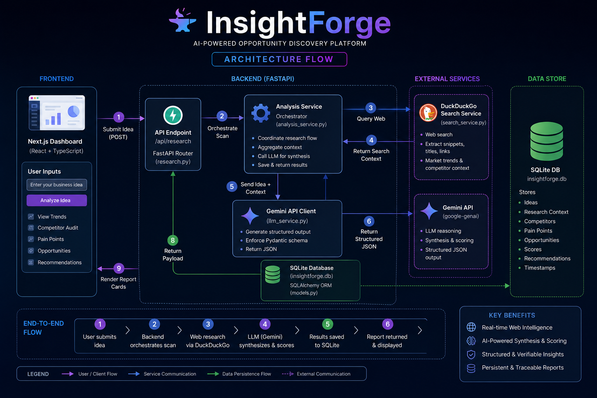
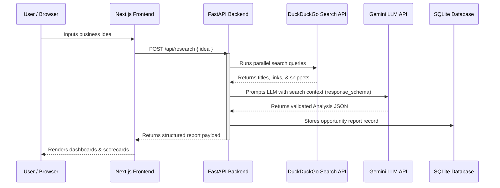

# InsightForge

[](https://nextjs.org)
[](https://fastapi.tiangolo.com)
[](https://ai.google.dev)
[](https://www.typescriptlang.org)
[](https://www.sqlite.org)

InsightForge is an AI-powered Opportunity Discovery Platform designed to help founders and developers identify high-potential business opportunities. By conducting real-time web research, auditing competitors, and analyzing customer pain points, it provides structured, evidence-based recommendations with quantitative feasibility scorecards.

---

## 📺 Demo
* **Live Demo:** `[Add Live Link Here]`
* **Video Demonstration:** `[Add YouTube/Vimeo Link Here]`

---

## 📸 Screenshots

### 1. Hackathon Project Cover


### 2. Software Data Flow & Architecture Infographic


---

## ✨ Features

* **Venture Scanning Console:** Interactive entry form equipped with clickable suggestion pills to kickstart business queries (e.g. *"Premium specialty coffee shop in Jaipur"*).
* **Multi-Stage Animated Loader:** A step-by-step progress checklist simulating background agent activities (indexing market metrics, scraping reviews, structuring pain points).
* **Founder's Recommendation Badge:** Prominently highlights the single best opportunity to pursue, backed by VC-style mentor logic.
* **Competitor Gap Audit:** Side-by-side matrices detailing key competitors, their strengths, and neglected gaps.
* **Opportunity Matrix:** Generates 3-5 distinct opportunities rated from 0 to 100 on demand, equipped with feasibility gauges and specific cited facts.
* **Collapsible Evidence Log:** Lists page titles and clickable external links of all sources scanned by the research agents.
* **Saved Scan History:** Left sidebar tracking historical queries, allowing users to switch between or delete reports.
* **Fault-Tolerant Connection:** Includes an auto-retry protocol with backoff logic to prevent Gemini 503 unavailability bottlenecks.

---

## ⚙️ How It Works

1. **Submit concept:** The user types a business concept on the dashboard.
2. **Scrape Web:** The backend triggers the search agents to execute parallel queries on DuckDuckGo, pulling down snippet summaries.
3. **Analyze & Structure:** The search data is combined with the concept and sent to Gemini, which structures the analysis inside a strict Pydantic JSON schema.
4. **Persist:** The report is saved to SQLite for local retrieval.
5. **Render:** The frontend parses the schema and displays interactive opportunity cards and scorecards.

---

## 🤖 Multi-Agent Architecture

InsightForge orchestrates the discovery workflow using two specialized agents:

1. **Web Research Agent:** Periodically queries search engines using the `duckduckgo-search` library to pull live market indicators, competitors, and user reviews.
2. **VC Analysis Agent:** Powered by **Gemini 3.1 Flash** (with fallback to mock context). This agent processes search signals, maps competitor vulnerabilities, rates opportunities, and generates co-founder recommendations using structured JSON outputs.

---

## 🛠️ Tech Stack

* **Frontend:** Next.js (App Router), TypeScript, TailwindCSS v4, Lucide Icons.
* **Backend:** FastAPI, Python, Pydantic, SQLAlchemy.
* **AI:** Google GenAI SDK (`gemini-3.1-flash`), Pydantic Response Schemas.
* **Search:** `duckduckgo-search` library (free & keyless).
* **Database:** SQLite.

---

## 📊 Project Architecture

The following diagram illustrates the functional data flow of the application:



---

## 📂 Folder Structure

```
InsightForge/
├── assets/                    # Hackathon cover and flow architecture diagrams
├── backend/
│   ├── app/
│   │   ├── routers/           # FastAPI API routers (research, reports)
│   │   ├── services/          # Services (search_service, llm_service, analysis_service)
│   │   ├── config.py          # Configuration and settings loader
│   │   ├── database.py        # SQLAlchemy SQLite engine setup
│   │   ├── main.py            # FastAPI main application container
│   │   ├── models.py          # SQLAlchemy SQLite database models
│   │   └── schemas.py         # Pydantic schemas
│   ├── requirements.txt       # Python backend dependencies
│   ├── .env.example           # Environment template variables
│   └── .env                   # Local configuration file
└── frontend/
    ├── public/                # Static public assets
    ├── src/
    │   ├── app/               # Next.js layouts, globals, and entry page
    │   ├── components/        # UI components (ResearchForm, ReportDashboard, Loader)
    │   └── lib/               # Lib helpers (api.ts endpoint client)
    ├── package.json           # Frontend dependencies
    └── tsconfig.json          # TypeScript configurations
```

---

## 📥 Installation

### Prerequisites
* Python 3.10+
* Node.js 18+

### 1. Backend Setup
1. Navigate to the backend folder:
   ```bash
   cd backend
   ```
2. Create and activate a virtual environment:
   ```bash
   python -m venv venv
   # On Windows (PowerShell):
   .\venv\Scripts\Activate.ps1
   # On macOS/Linux:
   source venv/bin/activate
   ```
3. Install dependencies:
   ```bash
   pip install -r requirements.txt
   ```

### 2. Frontend Setup
1. Navigate to the frontend folder:
   ```bash
   cd ../frontend
   ```
2. Install node packages:
   ```bash
   npm install
   ```

---

## 🔑 Environment Variables

Create a `.env` file in the `backend/` directory by copying `.env.example`:
```ini
# Gemini API Key (from Google AI Studio)
GEMINI_API_KEY=your_gemini_api_key_here

# Database URL
DATABASE_URL=sqlite:///./insightforge.db

# Server Configuration
PORT=8001
HOST=127.0.0.1
ENVIRONMENT=development
```

---

## 🚀 Running the Project

### 1. Start the Backend
Open a terminal in `backend/` and run:
```bash
# Verify venv is active
python -m uvicorn app.main:app --port 8001 --host 127.0.0.1 --reload
```
*The API docs will be available at:* `http://127.0.0.1:8001/docs`

### 2. Start the Frontend
Open a separate terminal in `frontend/` and run:
```bash
npm run dev
```
*The web interface will be available at:* `http://localhost:3000`

---

## 📡 API Endpoints

### 🩺 Health
* **`GET /api/health`**  
  Checks backend and database connectivity.

### 🔍 Research
* **`POST /api/research`**  
  Triggers automated search scans and Gemini analysis for a query. Saves results and returns a structured report.  
  *Payload:* `{"idea": "string"}`

### 📂 Reports
* **`GET /api/reports`**  
  Returns a chronological list of historical scans.
* **`GET /api/reports/{id}`**  
  Fetches full analysis details for a report ID.
* **`DELETE /api/reports/{id}`**  
  Deletes a specific report from history.

---

## 📋 Example Response

When calling `POST /api/research`, the API returns a structured JSON object matching the Pydantic schemas:

```json
{
  "id": 1,
  "idea": "Open a coffee shop in Jaipur",
  "market_summary": "The specialty coffee market in India is expanding rapidly...",
  "competitors": [
    {
      "name": "Starbucks",
      "strength": "Massive brand presence and established supply chains.",
      "weakness": "High price barriers and lack of localized flavor connection."
    }
  ],
  "customer_pain_points": [
    "Lack of quiet, high-speed workspace options for nomads."
  ],
  "opportunities": [
    {
      "name": "Co-Working Specialty Cafe Niche",
      "description": "A cafe specifically engineered for long-stay digital nomads...",
      "score": 85,
      "evidence": "Jaipur has seen an increase in freelance workers, yet local venues are too loud for calls."
    }
  ],
  "founder_recommendation": {
    "opportunity_name": "Co-Working Specialty Cafe Niche",
    "why": "This option yields high margins and immediately solves Jaipur's freelancer workspace problem."
  },
  "search_sources": [
    {
      "title": "Jaipur Cafe Scene Analysis 2026",
      "link": "https://example.com/jaipur-cafes",
      "snippet": "Freelance remote spaces are highly requested in Tier-2 Indian hubs..."
    }
  ],
  "created_at": "2026-06-22T21:42:30.813526"
}
```

---

## 🚀 Future Improvements

* **Multi-Query Refinement:** Allow users to ask follow-up questions to refine opportunities.
* **Financial Modeling Sandbox:** A basic calculator to test projected revenue margins for each opportunity card.
* **PDF Export:** Support downloading the completed co-founder analysis report.

---

## 🤝 Contributing

Contributions are welcome! Please fork the repository, make your changes on a separate branch, and submit a pull request.

---

## 📄 License

Distributed under the MIT License. See `LICENSE` for more information.

---

## ✍️ Author

* **Shoubhit** - *Initial Work & Capstone Project Submission*
